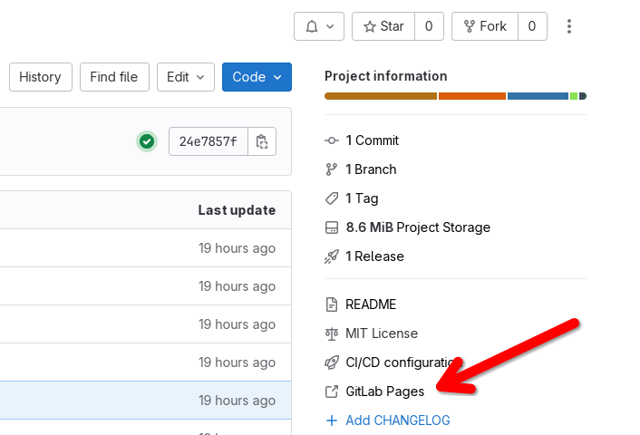

# Anguilla Search (Dev)

This is a complete programming environment with minimal dependencies. VSCode is provided as a web application ([Coder Server](https://coder.com)) with all the necessary extensions.
 In addition, a [Devcontainers](https://code.visualstudio.com/docs/devcontainers/containers) configuration is included, which also provides a ready to use environment in VSCode with just a few clicks so that you can start programming immediately.

A template for the Java program to be developed is also included. This contains a preconfigured Maven *pom.xml* file with the required dependencies and reporting tools.

This programming environment is supplied with Java 17 and Maven.

An intranet with various websites is also automatically provided to ensure a static environment for development and testing.

**Features**

- VSCode in the web browser with all required extensions.
- Java 17 and Maven already integrated.
- DevContainers environment with all required extensions for easy working with a locally available VSCode.
- Static intranet for development and testing.


## Contents

- [Anguilla Search (Dev)](#anguilla-search-dev)
  - [Contents](#contents)
  - [Installation (Dependencies)](#installation-dependencies)
  - [Quick Start (Working with VSCode in a Web Browser)](#quick-start-working-with-vscode-in-a-web-browser)
  - [Reach the Intranet from Host](#reach-the-intranet-from-host)
  - [Installation (using local VSCode or VSCodium)](#installation-using-local-vscode-or-vscodium)
    - [Locally Installed VSCode](#locally-installed-vscode)
    - [Locally Installed VSCodium](#locally-installed-vscodium)
  - [Usage (local VSCode or VSCodium)](#usage-local-vscode-or-vscodium)
  - [Generate and View Code Style Reportings](#generate-and-view-code-style-reportings)
  - [Execute the JAR](#execute-the-jar)
    - [Execute the JAR in the Development Environment](#execute-the-jar-in-the-development-environment)
    - [Execute the JAR using the Docker Image](#execute-the-jar-using-the-docker-image)
  - [List of pre-installed VSCode/Codium Extensions](#list-of-pre-installed-vscodecodium-extensions)
  - [Usage of the program AnguillaSearch](#usage-of-the-program-anguillasearch)
    - [Usage Example](#usage-example)
  - [Download](#download)


## Installation (Dependencies)

At least you need the following dependencies:

- Linux
    - Docker-Engine
    - Docker Compose
    - Git
- Mac
    - Docker Desktop
    - Git
-  Windows
    - Docker Desktop
    - WSL2 (Git is already included)


Clone this git repository

```bash
git clone https://git.propra-prod1.fernuni-hagen.de/propra/ws24-25/q9342591.git \
q9342591.git
```


## Quick Start (Working with VSCode in a Web Browser)

> *NOTE:* On the first start the docker images will be downloaded and the VSCode extensions will be automatically installed.


Navigate into the clone repository

```bash
cd q9342591.git
```

Start the docker environment and the intranet

```bash
docker compose -f docker-compose-dev.yml -f docker-compose-intranet.yml up
```


Open the following url in a web browser: [http://127.0.0.1:8080](http://127.0.0.1:8080)


Start programming :) ...


## Reach the Intranet from Host

To be able to visit the intranet website with your host's web browser, you must add the following DNS server: *172.32.0.2*


## Installation (using local VSCode or VSCodium)

The following steps are not necessary and are meant for experienced users. For the Programmierpraktikum it is sufficient to use VSCode in the browser as explained above. Continue only if you want to use a local installation of VSCode or VSCodium and know what you are doing.


### Locally Installed VSCode

1. Install VSCode. Installation instructions can be found [here](https://code.visualstudio.com/).

2. Install the [devcontainers](https://marketplace.visualstudio.com/items?itemName=ms-vscode-remote.remote-containers) extensions.


### Locally Installed VSCodium

*WARNING:* Devcontainers is a proprietary extension. Therefore, we need a workaround to make it work with VSCodium.

Here the problem is, that the *devcontainers* extension is not able to install the vscode-server inside of the docker container. We therefore use the *Open Remote - SSH* extension to install the vscode-server.


1. Install VSCodium. Installation instructions can be found [here](https://vscodium.com/)

2. Download the following extensions and install the *VSIX* files manually (*Extensions* -> *Install from VSIX...*).
   1. [Devcontainers](https://marketplace.visualstudio.com/items?itemName=ms-vscode-remote.remote-containers)
   2. [Open Remote - SSH](https://open-vsx.org/extension/jeanp413/open-remote-ssh)

3. Start the docker environment
    ```bash
    SSH_SERVER=true CODER_SERVER=false docker compose -f docker-compose-dev.yml up -d
    ```
4. Connect to the development container with VSCodium using the *Open Remote - SSH* extension (this will install the vscode-server):
   1. Open the Command Palette (*Ctrl + Shift + P*)
   2. Execute `> Remote-SSH: Connect to Host...`
   3. Connect to following host (password: vscode). A new window opens automatically.
       ```
       vscode@127.0.0.1:30022
       ```
   4. After connection has established without errors, close the connection (`Close Remote Connection`) and close the VSCodium window.
   5. Stop the docker environment:
       ```bash
       docker compose -f docker-compose-dev.yml down
       ```


## Usage (local VSCode or VSCodium)

1. Open the cloned *q9342591.git* folder with VSCode or VSCodium. Now Code prompt you to *Reopen in Container*. Note that the first start may take some time, as the necessary docker images must be loaded and the extensions installed within the *devcontainers* environment. You can also open the *devcontainers* environment by opening the Command Palette (*Ctrl + Shift + P*) and executing `Dev Containers: Reopen in Container`.

2. To go back to the local environment use the `Reopen Folder Locally` command.


## Generate and View Code Style Reportings


The following reportings can be generated:

- [PMD](https://pmd.github.io/): reports/pmd-report.html
- [Checkstyle](https://checkstyle.org/): reports/checkstyle-report.html
- [Spotbugs](https://spotbugs.github.io/): reports/spotbugs-report.html


Open a Terminal in VSCode or VSCodium (*View* -> *Terminal*) and execute the following command in the */home/vscode/workspace/* folder

```bash
mvn clean site
```

> *NOTE:* If you are using the locally installed VSCode or VSCodium, you must first *Reopen in container* if you have not already done so.

The generated project pages including the *Project Reports* can be found under `q9342591.git/target/site/`.

The GitLab CI/CD pipeline will also generate the *Project Reports* on every commit and provide them as a GitLab Page. 
The link to your report page can be found on the right-hand side of your GitLab project page:




## Execute the JAR

It should be ensured that the JAR is functional. This can be done directly in the development environment and also with the docker container created by the CI/CD pipeline.

### Execute the JAR in the Development Environment

Open a Terminal in VSCode or VSCodium (*View* -> *Terminal*) and execute the following command in the */home/vscode/workspace/* folder to build the JAR.
```bash
mvn clean package
```

> *NOTE:* To skip the test during the build, add `-Dmaven.test.skip`

Afterwards you can execute the jar
```bash
java -jar ./target/anguillasearch-1.0.0-SNAPSHOT.jar
```


### Execute the JAR using the Docker Image

To run the docker image created by the CI/CD pipeline.

> *NOTE:* The following commands must be executed on your host.

1. Make sure that the intranet is available.
    ```bash
    docker ps -a --filter status=running \
    --filter name=dns-server --filter name=web-server \
    --format '{{.Names}}\t{{.Status}}'
    ```
    If not, you can start the intranet with the following command.
    ```bash
    docker compose -f docker-compose-intranet.yml up -d
    ```
2. To pull the docker image from your container registry, you must first log in.
    ```bash
    docker login registry.propra-prod1.fernuni-hagen.de
3. Pull the latest image from the registry.
    ```bash
    docker image pull registry.propra-prod1.fernuni-hagen.de/propra/ws24-25/q9342591/anguilla-search:latest
    ```
4. Navigate to the root directory of your project folder and execute the container.
    ```bash
    docker run --rm -it \
    --net anguilla-search-dev --ip 172.32.0.8 \
    --dns="172.32.0.2" --dns="8.8.8.8" --dns="4.4.4.4" \
    -u $(id -u):$(id -g) \
    --mount type=bind,source="$(pwd)"/target/libs,target=/opt/anguillasearch/libs,readonly \
    --mount type=bind,source="$(pwd)"/logs,target=/opt/anguillasearch/logs \
    --mount type=bind,source="$(pwd)"/figures,target=/opt/anguillasearch/figures \
    registry.propra-prod1.fernuni-hagen.de/propra/ws24-25/q9342591/anguilla-search:latest
    ```
    > *NOTE:* Make sure that the directories to be mounted exist on your host and belong to you. If you are not creating visualizations of the network, you can remove the last *--mount*.

5. Stop the intranet if it was started in step 1.
    ```bash
    docker compose -f docker-compose-intranet.yml stop
    ```


## List of pre-installed VSCode/Codium Extensions

| Extension | Description |
| --------- | ----------- |
| *Extension Pack for Java* | Extension Pack for Java is a collection of popular extensions that can help write, test and debug Java applications in Visual Studio Code. |
| *SonarLint* | Linter to detect & fix coding issues locally in JS/TS, Python, PHP, Java, C, C++, C#, Go, IaC. |
| *Git Graph* | View a Git Graph of your repository, and perform Git actions from the graph. |
| *Red Hat Dependency Analytics* | Provides insights on security vulnerabilities in your application dependencies. |
| *Beautify* | Beautify code in place for VS Code. |
| *PlantUML* | Rich PlantUML support for Visual Studio Code. |
| *Markdown All in One* | All you need to write Markdown. |
| *Markdownlint* | Markdown linting and style checking for Visual Studio Code. |
| *Markdown Preview Github Styling* | Changes VS Code's built-in markdown preview to match Github's style. |
| *Meld Diff* | Use meld (or other tools like WinMerge, Beyond Compare, ...) to compare files, folders, clipboard or git changes from visual studio code directly. |

## Usage of the program AnguillaSearch

After successfully building and starting the program (see [Execute the JAR](#execute-the-jar)), a menu will appear in the console where you can select the search mode:

1. **Select program mode**  
   Choose a number (1, 2, or 3) to determine how the search results are calculated:  
   - `1`: search result relevance based on pure TFIDF scores
   - `2`: search result relevance based on cosine similarity between the query and the documents  
   - `3`: search result relevance based on using Cosine Similarity and PageRank as a combined score.

2. **Enter Search Query**  
   Next, you will be asked to enter your search terms.  
   For example:

   - Entering `exit` will exit the program.  
   - Otherwise, your input (for example `"flavor"`) will be processed into a search according to your earlier selection.

3. **Display Search Results**  
   The program crawls the websites `seedUrls` and all the sites they link to recursively and generates a ranking of results based on the selected search mode. 
   The console will display the amount of search results, the found urls, their titles and short snippets out of the body of the site.

4. **Continue Searching or Exit**  
   After the results are displayed, you will return automatically to the program mode selection menu.
   - Now you can chose a new mode,  
   - then either type `exit` to terminate the program,  
   - Or simply input a new search phrase and the same loop begins again.

### Usage Example

1. Start the program.  
2. Choose mode `2` for cosine similarity based site ranking.  
3. Enter the search query `"ricotta"`.  
4. View the ranked search results. 
5. Choose mode `1` for TFIDF score based site ranking. 
6. Input a new search term (for example `"gouda"`).
7. View the ranked search results.
8. If you want, switch to mode `3` for cosine and pagerank based siteranking and repeat the process with a new search query.  
9. Enter `exit` to close the program.

## Download

Download the latest `.jar` file from the [Releases page](https://git.propra-prod1.fernuni-hagen.de/propra/ws24-25/q9342591/-/releases).
